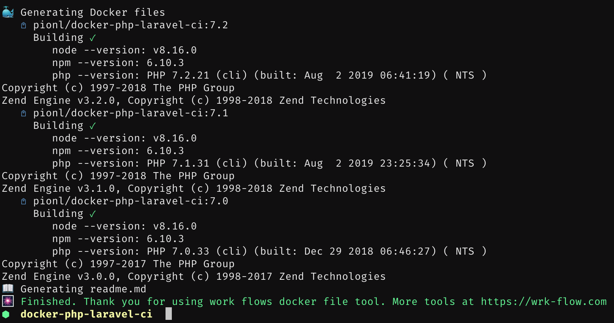

# Workflow - Docker


CLI tool for generating docker files from a template, building images from it, publishing them and optionally generating a readme file.



## Features

- Generate multiple Dockerfiles from a template with variable replace (for version matrix)
- Build and push all Docker images from single command
- Generate README file with all available tags from a template

## Install

### Locally for the project (package.json is required)

```
npm install wf-docker
```

### Globally

```
npm install -g wf-docker
```

## Usage

> Use this repository also as an example how to build docker images - this is build with current node versions.

Create `Dockerfile.template` in your directory.

- This is a base docker file that will be created. Build context is in your root folder.
- Directory will be created with `tag` name (if missing) and Dockerfile will be created from the template inside the
  directory.
- There are several tags that can be used in the template. More in [tags.md](./tags.md).

### (optional) Create `readme.template.md` in your root directory.

- If file is present, it will generate readme from the template.
- There are several tags that can be used in the template. More in [tags.md](./tags.md).
- Example in [readme.template.md](./readme.template.md)

### Configuration

Configuration is defined in json structure to allow cli usage without required arguments to be passed (as image name / tags)

You can use two ways:

1. Updating your `package.json` with `wf-docker` object in root of your package.json. For example check our package.json.
2. Create `.wf-docker.json` with same structure.

#### Config

- `name`: Defines the image name
- `description`: Your description. Used for generating readme. If package.json is used as config and description is not set, then root description is used.
- `tags`: Provide a list of docker images
- `run`: After building image run given commands on the built image

```json
{
  "name": "package/your-package",
  "wf-docker": {
    "image": "@namespace/@yourpackage",
    "tags": [
      "12",
      "14",
      "16",
      "17"
    ],
    "run": [
      "node --version",
      "npm --version"
    ]
  }
}

```

##### Tags with custom replacement

This feature enables replacing custom variables for each tag version. Instead of string for tag use an object.

```json
{
  "tags": [
    "12",
    {
      "tag": "7.4-node-14",
      "docker": {
        "php": "7.4",
        "node": "14",
        "composer": "v2.1.14"
      }
    },
    {
      "tag": "7.4-node-10",
      "docker": {
        "php": "7.4",
        "node": "10",
        "composer": "v2.1.14"
      }
    }
  ]
}
```

The `install` will be translated to `--install--` key that will be replaced in your docker template 

### Commands

> Image name and a list of tags are required if package.json does not exists in your directory.

```
Usage: 
    wf-docker build imageName tag1 tag2 ...
    wf-docker push imageName tag1 tag2 ...
    wf-docker build-push imageName tag1 tag2 ...
    wf-docker generate-readme imageName tag1 tag2
    
Options:
    --no-cache Do not use cache when building
    --help Print this help message
    --verbose, -v Prints docker build output
```

## Docker

You can use already built docker image.

```
docker run work-flow/wf-docker:12 wf-docker --version
```

You probably need to volume map to /app folder. For CI usage should be fine (not tested at this moment).

### Docker images with different node versions (wrkflow/wf-docker)

 

Image | Badges
 --- | ---
**wrkflow/wf-docker:12** | 
**wrkflow/wf-docker:14** | 
**wrkflow/wf-docker:16** | 
**wrkflow/wf-docker:17** | 
**wrkflow/wf-docker:12-alpine** | 
**wrkflow/wf-docker:14-alpine** | 
**wrkflow/wf-docker:16-alpine** | 
**wrkflow/wf-docker:17-alpine** | 


## TODO

- [ ] Improve docs **feedback wanted**
- [ ] Parallel building
- [x] Ability to build only readme (partially done)
- [x] Custom config file (to not force package.json)
- [ ] Customize file names / directory for templates.
- [ ] Base template
- [ ] Init command?
- [ ] Github badges if set?
- [ ] Github actions atuomation for minor version update?
- [ ] Unit tests
- [ ] Auto-test build
- [ ] Append run response to readme
- [ ] Add ability Dockerfile.template for each tag (like alpine apk vs apt-get)

## Examples

- Multiple PHP versions with different NodeJS and composer version: https://github.com/pionl/docker-php-laravel-ci
- Multiple NodeJS versions with OpenSSH / Git installed https://github.com/pionl/docker-node-clone-ready 
