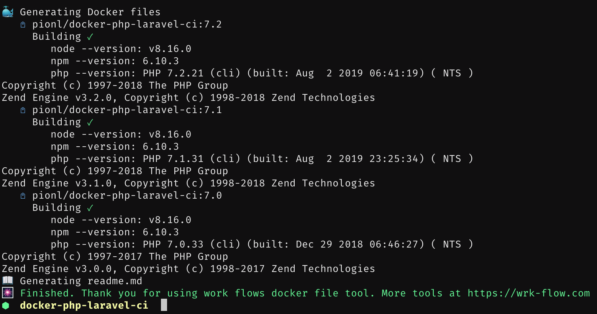

# Workflow - Docker

--DESCRIPTION--



## Usage

> Use this repository also as an example how to build docker images - this is build with current node versions.

Create `Dockerfile.template` in your directory.

- This is a base docker file that will be created. Build context is in your root folder.
- Directory will be created with `tag` name (if missing) and Dockerfile will be created from the template inside the directory.
- There are several tags that can be used in the template. More in [tags.md](./tags.md).

### (optional) Create `readme.template.md` in your root directory.

- If file is present, it will generate readme from the template.
- There are several tags that can be used in the template. More in [tags.md](./tags.md).
- Example in [readme.template.md](./readme.template.md)

### (recommended) Update your `package.json`

For easier usage use your package.json as a config to not be required passing imageName and tags to cli.

#### Config

- `tags`: Provide a list of docker images
- `run`: After building image run given commands on the built image

```json
{
  "name": "your-package",
  "wf-docker": {
    "image": "@namespace/@yourpackage",
    "tags": [
      "12",
      "14",
      "16",
      "17"
    ],
    "run": [
      "node --version",
      "npm --version"
    ]
  }
}

```

### Commands

> Image name and a list of tags are required if package.json does not exists in your directory.

```
Usage: 
    wf-docker build imageName tag1 tag2 ...
    wf-docker push imageName tag1 tag2 ...
    wf-docker build-push imageName tag1 tag2 ...
    
Options:
    --no-cache Do not use cache when building
    --help Print this help message
    --verbose, -v Prints docker build output
```

## Docker

You can use already built docker image.

```
docker run work-flow/wf-docker:12 wf-docker --version
```

You probably need to volume map to /app folder. For CI usage should be fine (not tested at this moment).

### Docker images (node version, --IMAGE_NAME--)

--TAGS--
